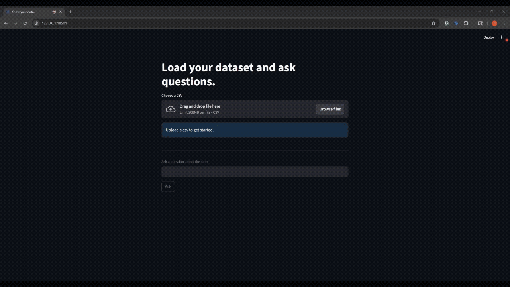

# Chat with your CSV (FastAPI + Streamlit + FAISS + Local LLM)

A minimal RAG demo: upload a CSV, build an index, ask questions, and get answers with row-level citations.
Backend is FastAPI, UI is Streamlit, retrieval is FAISS, embeddings + LLM run locally via Ollama (e.g., `nomic-embed-text` + `gemma3:1b`).

Why this exists: prove end-to-end ability to design, deploy, and operate a chat-based data interaction tool. It’s intentionally small, explicit, and production-ish.

## Demo


UI: upload CSV → click Build index → ask a question → see Answer + Sources (row N)

## Features
- CSV ingestion → one document per row, with row IDs kept in metadata
- Local embeddings (`nomic-embed-text`) + local tiny LLM `(gemma3:1b`) via Ollama
- Retrieval: FAISS top-k with optional MMR diversification
- Citations: the model is instructed to cite `[row N]` and a “Sources” footer
- Persistence: FAISS index saved under `./data/index` and auto-loaded on restart
- Simple contracts: `POST /ingest` (multipart) and `POST /ask` (JSON)

## Architecture
```css
[Streamlit UI]  ── /ingest (multipart CSV) ─────────▶  [FastAPI]
     │                                              (pandas → docs → embeddings → FAISS)
     │                                                                       │
     └── /ask {question} ────────────────────────────────────────────────────┘
                                                                          ▼
                                                                [Retriever: FAISS]
                                                                          ▼
                                                               [Prompt Builder]
                                                                          ▼
                                                 [LLM via Ollama: gemma3:1b (chat)]
                                                                          ▼
                                            {"answer": "...", "sources": [row ids]} → UI
```

## Project Layout
```bash
chat_app/
  app/
    api.py          # FastAPI: /ingest, /ask, /healthz
    ui.py           # Streamlit UI
    rag/
      ingest_data.py  # vectorize_data() + load_index_if_exists()
      retrieve.py      # retriever()
      prompt.py        # build_prompt()
      respond.py       # respond()
  data/
    index/           # persisted FAISS + metadata.json
  docker-compose.yml
  Dockerfile
  requirements.txt
```

## Prerequisites
- Docker Desktop (or a working Docker + Compose setup)
- Ollama running on the host, with models pulled:
    ```
    ollama pull nomic-embed-text
    ollama pull gemma3:1b
    ```

## Quickstart
1. Set env vars (optional; sensible defaults exist). For Windows PowerShell:
    ```
    $env:LLM_PROVIDER="ollama"
    $env:OLLAMA_BASE_URL="http://host.docker.internal:11434"
    $env:LLM_MODEL="gemma3:1b"
    $env:EMBEDDING_MODEL="nomic-embed-text"
    ```
2. Build & run
    ```
    docker compose up --build
    ```
3. Open the app
    - UI: http://127.0.0.1:18501/
4. Use
    - Upload a CSV → Build index → ask a question → see answer + sources.

## Configuration
Environment variables (set in Compose or your shell):
- LLM / Embeddings
    - LLM_PROVIDER = ollama (default) or openai
    - OLLAMA_BASE_URL = http://host.docker.internal:11434 (default)
    - LLM_MODEL = gemma3:1b (default)
    - EMBEDDING_MODEL = nomic-embed-text (default)
    - LLM_TIMEOUT = per-request timeout seconds (default 30)
    - MAX_TOKENS = chat completion max tokens (default 256)
- Retrieval
    - RETRIEVAL_MODE = mmr (default) or similarity
    - FETCH_K = candidate pool for MMR (default 24)
    - MMR_LAMBDA = 0..1 (default 0.7; higher = more similar, lower = more diverse)
    - PER_DOC_CHARS = truncate each retrieved snippet (default 600)
    - MAX_CTX_CHARS = total context budget (default 2400)
    - MAX_ROWS = cap rows ingested for demo speed (default 5000)
- Paths
    - INDEX_DIR = where FAISS persists (default /workspace/data/index)

## Performance & limits
- Tiny CPU model (`~1B` params) = coherent for short, grounded answers. Keep questions concise, retrieval tight, and temperature `0`.
- Ingest time scales with rows × embedding time. Cap `MAX_ROWS` for demos, or be patient on first ingest (warm up embeddings at startup if needed).
- Index reuse: FAISS is persisted; on server restart, it auto-loads (if present).
- Model change: if you change the embedding model, rebuild the index.